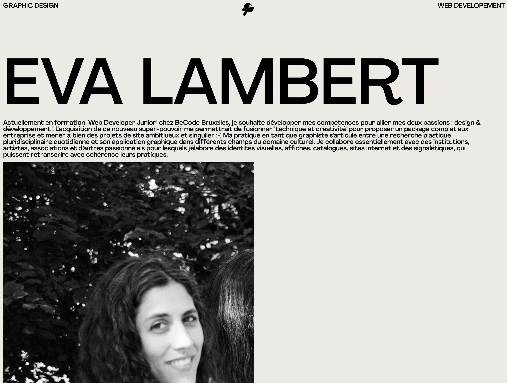

# CURRICULUM VITAE

## 🔗 LIEN VERS LE PROJET

[https://evalambert.github.io/cv/](https://evalambert.github.io/cv/)

## 🎯 OBJECTIFS

Utiliser le système de grille CSS

## 👉 CONSIGNES

- Créer un repository
- Rédigez votre CV en HTML et CSS
- Utiliser CSS Grid
- Commiter and pusher
- Déployer sur une page Github

## 🌐 LANGUAGE UTILISÉ

HTML & CSS Grid

## ⏰ ÉTAT D'AVANCEMENT

- Quelques modifs à faire 🙃

## 👀 APERÇU DU PROJET

